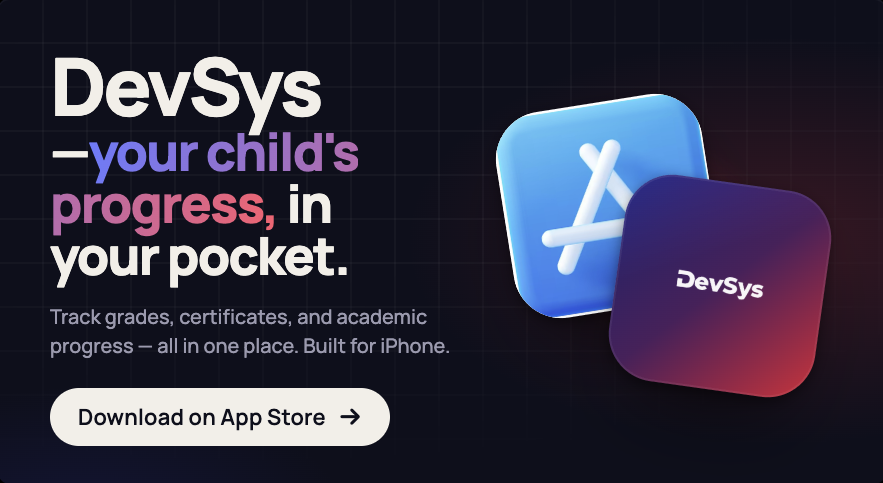
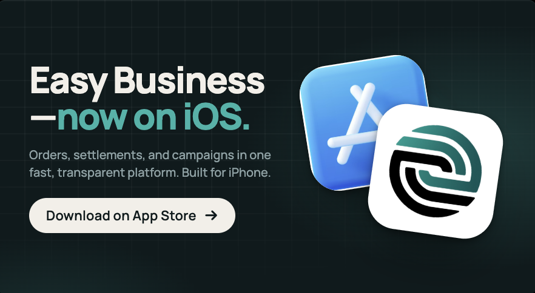
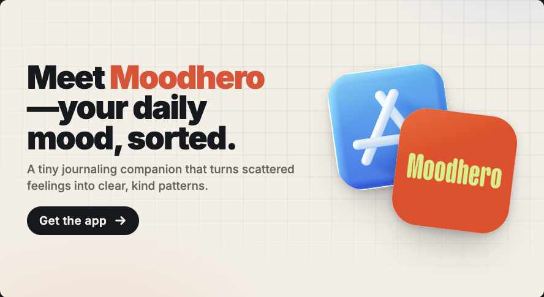

<!-- Custom animated hero (hand-coded SVG: gradient name, animated underline, floating particles) -->
<p align="center">
  
</p>

<!-- Animated typing intro -->
<h3 align="center">
  <a href="https://elshdma.online/">
    
  </a>
</h3>

<!-- Live counters -->
<p align="center">
  
  <a href="https://github.com/elsad159?tab=followers">
    
  </a>
  <a href="https://github.com/elsad159?tab=repositories">
    
  </a>
</p>


<!-- Animated section header -->
<h2 align="center">
  
</h2>

```ts
const elshad = {
  role:        "Mobile / App Developer",
  location:    "building from anywhere",
  currently:   ["DevSys", "EasyBusiness", "MoodHero"],
  stack:       ["Swift", "Kotlin", "React Native", "Expo", "TypeScript", "Node.js"],
  philosophy:  "Build what you wish existed.",
  website:     "https://elshdma.online",
};
```

<!-- "Now" pill row — what I'm into this week -->
<p align="center">
  
  
  
  
</p>


<!-- Animated section header -->
<h2 align="center">
  
</h2>

<table>
  <tr>
    <td width="50%" valign="top">
      <a href="#"></a>
      <h3 align="center">DevSys</h3>
      <p align="center"><i>Your child's progress, in your pocket.</i></p>
      <p align="center">Track grades, certificates, and academic progress — all in one place. Built for iPhone and Android.</p>
      <p align="center">
        <a href="#"></a>
        <a href="#"></a>
      </p>
    </td>
    <td width="50%" valign="top">
      <a href="#"></a>
      <h3 align="center">Easy Business</h3>
      <p align="center"><i>Orders, settlements, and campaigns — one fast, transparent platform.</i></p>
      <p align="center">A business operations toolkit for iPhone, Android, and the web.</p>
      <p align="center">
        <a href="#"></a>
        <a href="#"></a>
        <a href="#"></a>
      </p>
    </td>
  </tr>
  <tr>
    <td width="50%" valign="top">
      <a href="#"></a>
      <h3 align="center">MoodHero</h3>
      <p align="center"><i>Your daily mood, sorted.</i></p>
      <p align="center">A tiny journaling companion that turns scattered feelings into clear, kind patterns.</p>
      <p align="center">
        <a href="#"></a>
        <a href="#"></a>
      </p>
    </td>
    <td width="50%" valign="top">
      <br/>
      <p align="center">
        
      </p>
      <p align="center"><i>...more on the way.</i></p>
    </td>
  </tr>
</table>


<!-- Animated section header -->
<h2 align="center">
  
</h2>

<p align="center">
  
</p>

<p align="center">
  
  
  
  
  
  
  
  
  
</p>


<!-- Dev quote of the day (random, re-rolls on each page load) -->
<p align="center">
  
</p>


<!-- Animated section header -->
<h2 align="center">
  
</h2>

<p align="center">
  <a href="https://elshdma.online/">
    
  </a>
  <a href="https://www.linkedin.com/in/elshadkhalilov/">
    
  </a>
  <a href="mailto:elsad.xalilov1111@gmail.com">
    
  </a>
</p>

<p align="center">
  <a href="https://github.com/elsad159">
    
  </a>
</p>

<!-- Animated wave footer (matched to header palette) -->
<p align="center">
  
</p>
